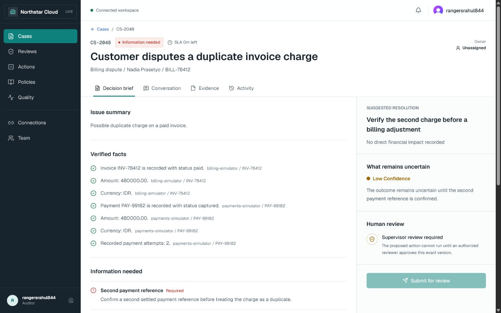
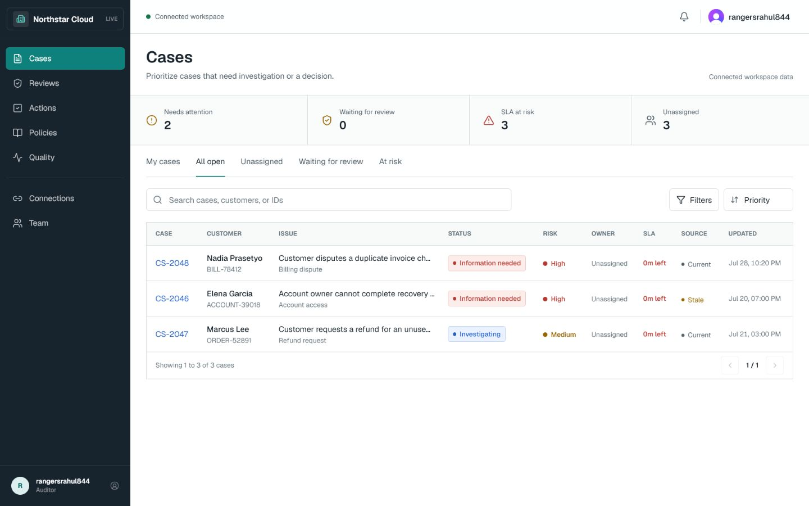
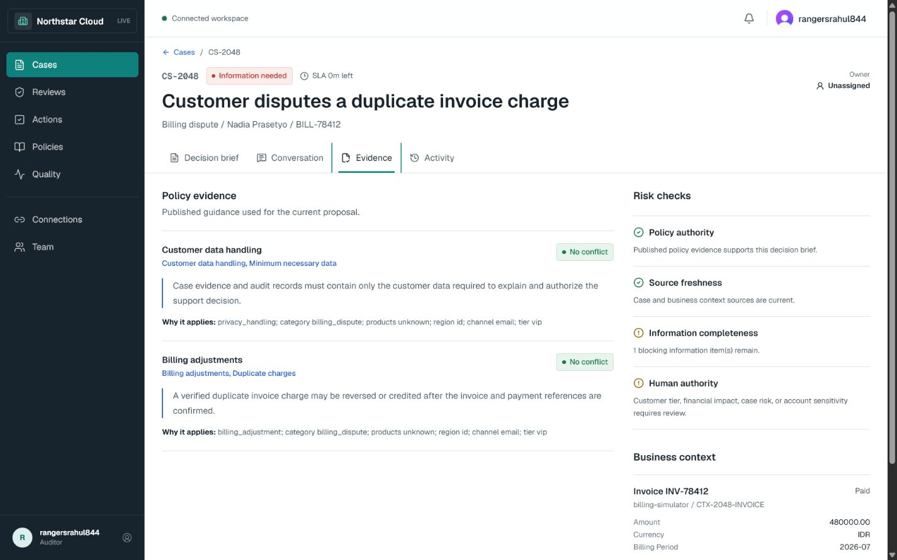
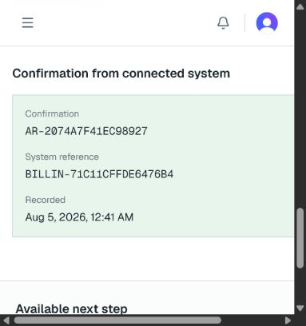
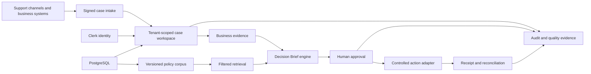

# Case Resolution Copilot

A policy-governed decision workspace for complex customer cases.

Case Resolution Copilot helps a support team assemble scattered evidence, retrieve the applicable
policy version, prepare a reviewable resolution, obtain human approval, and execute a controlled
action with an auditable recovery path. The AI provider may draft bounded narrative from a
server-generated control record;
application controls and authorized people decide what may happen.

> From scattered evidence to an approved, verifiable resolution.

[](docs/evidence/production-demo/README.md)

[Hosted application](https://ai-support-escalation-copilot.vercel.app) | [Engineering case study](docs/portfolio/CASE_STUDY.md) | [Three-minute demo](docs/portfolio/DEMO_SCRIPT.md)

The hosted application is invite-only. The public walkthrough contains labelled demo data only.

## Evidence Snapshot

| Metric | Governed coverage | Supporting artifact |
| ---: | --- | --- |
| **4** | Specialist, Supervisor, Administrator, and Auditor roles | [Baseline acceptance matrix](backend/evaluations/acceptance/local_release_matrix.json) |
| **71** | Baseline acceptance variants covering 54 controls | [Baseline acceptance matrix](backend/evaluations/acceptance/local_release_matrix.json) |
| **19** | Baseline traceable proofs across 8 scenarios and 21 workflow variants | [Workflow traceability map](backend/evaluations/workflow/traceability.json) |
| **83.7%** | Raw median elapsed time lower in a developer-operated matched synthetic benchmark: 95 s with Copilot versus 582 s manually | [Workflow benchmark report](docs/evidence/developer-workflow-benchmark/REPORT.md) |

The separate [historical hosted acceptance record](docs/evidence/hosted-e2e-acceptance/2026-08-05/README.md)
shows the recorded synthetic workflow from Specialist submission through Supervisor approval,
controlled execution, duplicate blocking, and Auditor inspection. These are engineering-coverage
metrics and bounded product evidence, not customer-impact measurements.

The time-saved figure is descriptive benchmark evidence from one operator and three matched
synthetic cases per condition. It is not presented as a population-level productivity claim.

## Why It Exists

Complex cases rarely live in one message. Facts can be split across conversations, payments,
orders, account records, policies, and internal notes. A fast AI answer can sound certain while
using stale policy, overlooking missing evidence, or proposing an action nobody authorized.

This product is organized around a more useful set of questions:

> What is known, what is missing, which policy applies, what could go wrong, and who must approve
> the next step?

## Product Workflow

```text
Case intake -> Triage -> Evidence and policy review -> Decision Brief
            -> Human review -> Controlled action -> Receipt and reconciliation
```

- **Cases** prioritizes work by risk, SLA, status, ownership, and source freshness.
- **Decision Brief** separates verified facts, missing information, uncertainty, and recommendation.
- **Conversation and Evidence** keep business records and policy citations inspectable.
- **Reviews** bind human authority to one immutable proposal and evidence snapshot.
- **Actions** use idempotency, durable receipts, unknown-outcome handling, and reconciliation.
- **Policies and Quality** govern what the system may rely on and how behavior is evaluated.

## Product Tour

<table>
  <tr>
    <td width="50%">
      <a href="docs/evidence/production-demo/01-cases-queue.png"></a><br>
      <strong>Operational queue</strong><br>
      Triage by risk, SLA, ownership, status, and source freshness.
    </td>
    <td width="50%">
      <a href="docs/evidence/production-demo/02-decision-brief.png"></a><br>
      <strong>Decision Brief</strong><br>
      Verified facts, missing evidence, uncertainty, and the review boundary.
    </td>
  </tr>
  <tr>
    <td width="50%">
      <a href="docs/evidence/production-demo/04-evidence.png"></a><br>
      <strong>Traceable evidence</strong><br>
      Policy clauses and business records remain connected to sources.
    </td>
    <td width="50%">
      <a href="docs/evidence/hosted-e2e-acceptance/2026-08-05/05-action-completed-receipt.png"></a><br>
      <strong>Controlled execution</strong><br>
      Approved actions preserve attempts, receipts, and external references.
    </td>
  </tr>
</table>

The [product walkthrough](docs/evidence/production-demo/README.md) and
[hosted deterministic acceptance](docs/evidence/hosted-e2e-acceptance/2026-08-05/README.md) were
captured from the predecessor hosted deployment of the same product. They prove those observed
states, not the correctness of the current source revision; current source verification is reported
separately below.

## Authority Model

| Layer | Responsibility |
| --- | --- |
| AI provider | Draft structured narrative from bounded case and policy context. |
| Application controls | Enforce tenant scope, policy freshness, evidence binding, permissions, approval state, and action safety. |
| Human reviewer | Accept responsibility for the exact proposal version before a consequential action. |
| External system | Return a receipt or an explicitly unknown outcome that must be reconciled. |

AI confidence cannot grant approval, bypass missing evidence, or authorize a side effect.

## Architecture



The stack is Next.js, TypeScript, FastAPI, PostgreSQL/pgvector, Clerk, and an optional OpenAI
narrative provider. It is a modular monolith, not a microservice system. Deterministic providers
keep repository verification independent of paid credentials.

## Verification Evidence

### Current reconstructed-source verification

| Evidence layer | Result |
| --- | ---: |
| Release-hardening static checks | Ruff, strict Mypy over 290 backend application files, TypeScript, and ESLint passed |
| Release-hardening regressions | 389 backend unit/contract tests and 160 frontend tests passed serially |
| Migration and secret safety | Full Alembic SQL generation passed through revision `0024`; repository secret scan found 0 findings |

The guarded PostgreSQL integration suite has not been rerun for this reconstructed revision. Static
Alembic SQL generation does not prove that revisions `0021`-`0024` have been applied successfully to
a live PostgreSQL database, and credential-free tests do not prove Google or OpenAI activation.

### Baseline coverage artifacts

- The [local acceptance matrix](backend/evaluations/acceptance/local_release_matrix.json) records
  54 controls exercised through 71 acceptance variants.
- The [workflow traceability map](backend/evaluations/workflow/traceability.json) records 19
  traceable proofs across 8 scenarios and 21 workflow variants.

These committed baseline artifacts describe designed coverage; they are not presented as a fresh
full-release or PostgreSQL rerun for the reconstructed revision.

### Historical hosted product evidence

The [hosted deterministic acceptance](docs/evidence/hosted-e2e-acceptance/2026-08-05/README.md)
records Specialist submission, Supervisor approval, one controlled action, durable receipt
capture, duplicate blocking, and Auditor read-only inspection for synthetic case `CS-2050`. It
comes from the predecessor hosted deployment and does not prove that the current reconstructed
commit is deployed.

The [GitHub quality gate](https://github.com/williamlo90/case-resolution-copilot/actions/workflows/quality-gate.yml)
runs on pull requests or manual dispatch, never on every push. It adds dependency audits and a
production Next.js build. This policy avoids accidental GitHub Actions usage while preserving a
review gate.

## Run Without Paid Credentials

Requirements: Python 3.12, `uv`, Node.js, and `pnpm`.

```powershell
git clone https://github.com/williamlo90/case-resolution-copilot.git
cd case-resolution-copilot

cd backend
uv sync --frozen --group dev
uv run python -m scripts.run_release_verification
```

The verifier runs serially and starts no browser, application server, container, database, or
external model call. See the [backend guide](backend/README.md), [frontend guide](frontend/README.md),
and [resource policy](RESOURCE_SAFETY_POLICY.md).

## Claim Boundaries

- This is a production-oriented portfolio project and controlled-pilot candidate, not a claim of
  general production readiness.
- The hosted identity setup uses an invite-only Clerk development instance.
- No client-owned case source or controlled-action sandbox is connected.
- Public benchmark records and synthetic controls test the evaluation system; they are not complete
  client cases and do not prove customer impact.
- Current external gates include disposable-database verification, provider failure drills, restore
  cutover, production telemetry, accessibility research, penetration testing, bounded load testing,
  and complete anonymized client-case validation.

## Documentation

- [Documentation index](docs/README.md)
- [Product contract](docs/product/PRODUCT_CONTRACT.md)
- [UX architecture](docs/product/UX_ARCHITECTURE.md)
- [Engineering case study](docs/portfolio/CASE_STUDY.md)
- [API conventions](docs/api/CONVENTIONS.md)
- [Evaluation strategy](docs/backend/EVALUATION_STRATEGY.md)
- [Controlled pilot runbook](docs/pilot/PILOT_RUNBOOK.md)
- [Security hardening](docs/runbooks/SECURITY_HARDENING.md)
- [Post-environment verification](docs/runbooks/POST_ENV_VERIFICATION.md)
