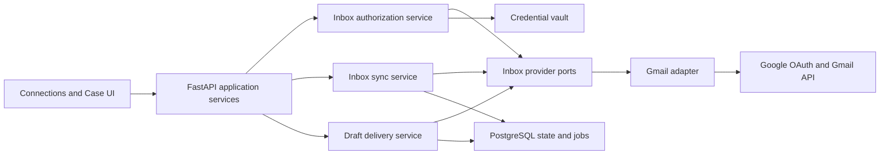
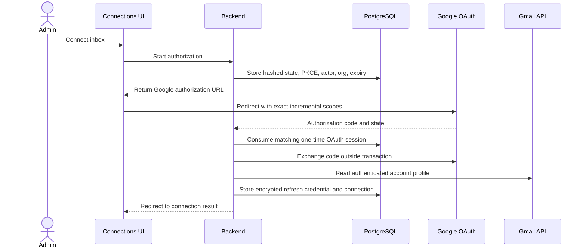
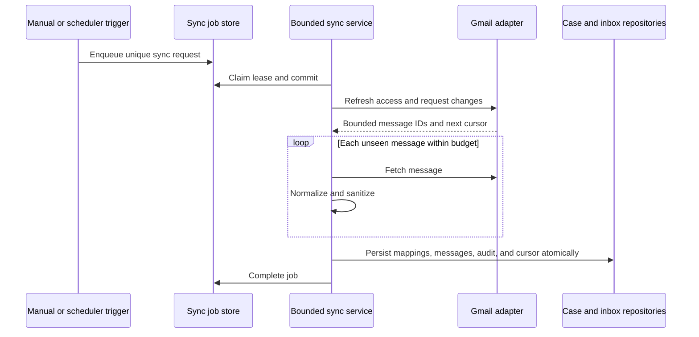
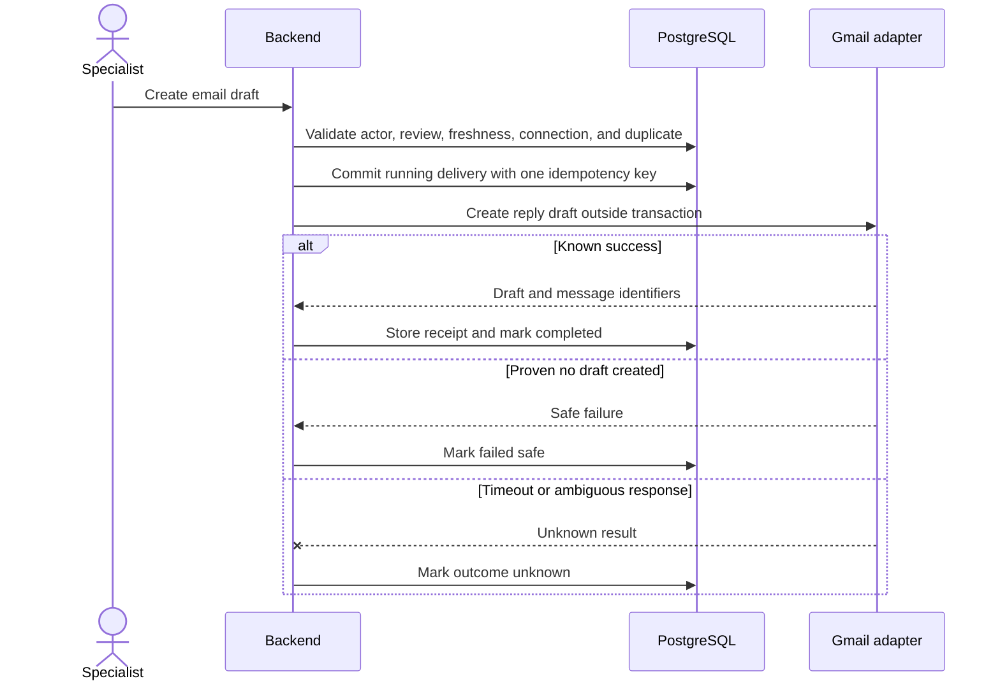

# Connected Inbox Architecture

Status: Phase 3 source implemented; database and live-provider activation pending

Date: 2026-08-12

Depends on:

- `docs/product/CONNECTED_WORKFLOW_CONTRACT.md`
- `docs/adr/ADR-005-backend-modular-monolith.md`
- `docs/adr/ADR-006-postgresql-source-of-truth.md`
- `docs/adr/ADR-007-provider-neutral-connected-inbox.md`

## 1. Purpose

This document specifies the implementation boundary for importing a bounded Gmail conversation into
a case and writing an approved response back as a Gmail draft. It defines ports, ownership, schema,
OAuth security, sync, idempotency, recovery, observability, rollout, and tests before feature code is
written.

The design deliberately adds no general email client, autonomous agent, or send capability.

## 2. Existing Baseline

The implementation must reuse these existing boundaries:

- `connections` owns secret-free provider capability and health metadata;
- `ConnectionRepository` and `ConnectionService` own connection reads and health checks;
- `CaseModel`, `ConversationThreadModel`, and `ConversationMessageModel` own local case content;
- `ResponseDraftModel` owns the editable local customer response;
- PostgreSQL owns durable state and duplicate protection;
- review snapshots and action fingerprints own authorization freshness;
- audit events record attributable material changes;
- provider calls occur outside database transactions.

The feature must not add OAuth exchange, Gmail calls, or mailbox loops to API route modules,
`CaseRepository`, or `ReviewRepository`.

## 3. Target Components



### Application modules

| Module | Responsibility | Must not own |
| --- | --- | --- |
| `domain/inbox/` | Provider-neutral records, states, commands, and errors | Gmail SDK objects |
| `integrations/inbox_gateway.py` | Provider ports and adapter registry | Persistence or HTTP routes |
| `integrations/gmail/` | OAuth and Gmail API translation | Case state or review authority |
| `security/credential_vault.py` | Encrypt, decrypt, rotate, and delete token envelopes | Connection presentation |
| `services/inbox/authorization.py` | Start and callback orchestration | Token cryptography details |
| `services/inbox/sync.py` | Claim bounded jobs and import normalized messages | OAuth redirects |
| `services/inbox/draft_delivery.py` | Validate authorization and create/reconcile one draft | Email sending |
| `persistence/inbox/` | Inbox credentials, messages, checkpoints, jobs, and deliveries | Provider calls |
| `api/routes/inbox_connections.py` | Authenticated command and callback boundary | Workflow logic |
| `api/routes/inbox_internal.py` | Authenticated bounded scheduler boundary | Message import itself |

The existing connection service remains the query owner for secret-free cards and health. New
services enrich it through repositories rather than bypassing it.

## 4. Provider Ports

The design target is equivalent to these protocols. Names may change during implementation, but
capabilities may not broaden silently.

```python
class InboxAuthorizationGateway(Protocol):
    provider_name: str

    def authorization_url(self, request: AuthorizationRequest) -> str: ...
    def exchange_code(self, request: AuthorizationCallback) -> GrantedCredential: ...
    def refresh_access(self, credential: RefreshCredential) -> AccessCredential: ...
    def revoke(self, credential: RefreshCredential) -> RevocationResult: ...


class InboxReadGateway(Protocol):
    provider_name: str

    def get_account(self, access: AccessCredential) -> ProviderAccount: ...
    def initial_page(self, request: InitialSyncRequest) -> MessagePage: ...
    def changes(self, request: IncrementalSyncRequest) -> ChangePage: ...
    def message(self, request: MessageRequest) -> ProviderMessage: ...


class InboxDraftGateway(Protocol):
    provider_name: str

    def create_reply_draft(self, request: CreateDraftRequest) -> DraftReceipt: ...
    def find_draft(self, request: FindDraftRequest) -> DraftLookupResult: ...
```

There is intentionally no generic request method and no send method. Provider DTOs are converted to
validated domain records before they reach a repository.

## 5. Gmail Capability Decision

The controlled adapter requests incrementally:

1. `gmail.readonly` when an administrator enables conversation import;
2. `gmail.compose` only when the workspace enables Gmail draft write-back.

Both are restricted scopes. `gmail.compose` permits managing drafts and sending email even though the
product uses only `users.drafts.create`. Therefore:

- the consent disclosure must state the technical scope and narrower product behavior accurately;
- the adapter exposes only draft creation and lookup;
- source checks reject `/messages/send`, `/drafts/send`, and corresponding SDK methods;
- no route, service command, permission, or UI control represents sending;
- production activation requires a Google policy and security review decision;
- disconnect attempts provider revocation and always deletes the local credential envelope.

This is a compensating-control design, not a claim that the OAuth token is draft-only.

## 6. Durable Data Model

All foreign keys include `organization_id` where a tenant-owned relation is involved. Public IDs are
generated server-side. Provider identifiers are stored as opaque strings and never accepted as
tenant authority.

### Reuse `connections`

The existing row stores:

- `provider_type = inbox`;
- `adapter_key = gmail_v1`;
- `environment = sandbox` for the controlled pilot;
- `read_capabilities = [conversation_read]` after read consent;
- `write_capabilities = [draft_create]` only after compose consent;
- secret-free credential and health status.

No token, authorization code, client secret, nonce, or ciphertext is added to this table.

### `inbox_connection_profiles`

One provider-account profile for one connection.

| Column | Purpose |
| --- | --- |
| `id`, `public_id`, `organization_id`, `connection_id` | Tenant-scoped identity |
| `provider_account_id` | Stable provider identity when available |
| `account_address` | Normalized connected mailbox address |
| `import_mode` | `paused`, `manual`, or `scheduled` |
| `label_filter` | Allowlisted provider labels; initially `INBOX` |
| `initial_window_days` | Bounded initial history window |
| `initial_item_limit` | Hard initial import ceiling |
| `watch_expires_at` | Optional future Pub/Sub watch expiry |
| `last_successful_sync_at` | User-facing freshness |
| `version`, timestamps | Optimistic concurrency and audit support |

Constraints:

- unique `(organization_id, connection_id)`;
- unique `(organization_id, provider_account_id)` for active profiles;
- `initial_window_days` and `initial_item_limit` have conservative database bounds.

### `connection_credential_envelopes`

Secret repository accessible only through `CredentialVault`.

| Column | Purpose |
| --- | --- |
| `organization_id`, `connection_id` | Tenant-bound owner |
| `ciphertext`, `nonce`, `authentication_tag` | Authenticated encrypted refresh credential |
| `key_id`, `algorithm` | Rotation and decryption metadata |
| `granted_scopes` | Exact normalized grant |
| `credential_fingerprint` | Non-secret correlation without token logging |
| `expires_at`, `rotated_at`, timestamps | Lifecycle evidence |

The controlled implementation uses AES-256-GCM through a cryptography adapter and a 32-byte master
key supplied only to the backend environment. Additional authenticated data binds ciphertext to
organization, connection, provider, and key ID. Access tokens remain process-local and short-lived;
they are not persisted.

This database envelope is approved only for the controlled test. Public production activation
requires a managed key service or a separately reviewed equivalent-strength key-management design;
the project must not claim that a plain environment variable alone satisfies Google's restricted
scope security requirements.

### `inbox_oauth_sessions`

Short-lived, one-time authorization state.

- organization, actor, provider, requested capabilities, and safe return path;
- hash of the OAuth state plus an encrypted PKCE verifier needed for the code exchange;
- expiry, consumed time, and attempt count;
- unique state hash and a maximum lifetime of ten minutes.

Consumed and expired sessions are deleted by bounded cleanup. The callback cannot create a
connection for a different signed-in actor or active organization.

### `external_conversations`

Maps one provider thread to one case and local conversation thread.

- organization, connection, case, and local thread IDs;
- provider thread ID and normalized subject;
- first and latest provider message time;
- latest imported provider message ID;
- source payload fingerprint and version.

Unique `(organization_id, connection_id, provider_thread_id)` prevents duplicate cases from replay.
The mapping survives disconnect for historical traceability.

### `external_messages`

Maps one provider message to one local conversation message.

- organization, connection, external conversation, and local message IDs;
- provider message ID and optional RFC `Message-ID`;
- direction, sender snapshot, recipient snapshot, provider received time, and observed time;
- sanitized-content hash, raw-source hash, parser version, and omission reason;
- attachment count and immutable source metadata.

Unique `(organization_id, connection_id, provider_message_id)` is the ingestion idempotency boundary.
Email body content stays in the existing local conversation message. Raw Gmail API responses are not
persisted.

### `external_attachments`

Stores metadata and evidence availability, not unrestricted binary payloads.

- provider attachment ID, external message ID, name, media type, and reported size;
- content status: `metadata_only`, `available`, `unsupported`, `too_large`, `blocked`, or `deleted`;
- optional local evidence reference and content hash;
- parser and malware-scan status when content processing is later enabled.

Phase 3 imports metadata only. Attachment bytes remain out of scope until an allowlist, size limit,
malware scan, retention, and deletion implementation exists.

### `inbox_sync_checkpoints`

One current cursor per connection:

- provider history ID;
- last observed and last committed history ID;
- last attempt, success, and full-resync time;
- status: `current`, `syncing`, `delayed`, `failed`, or `reauthorize`;
- consecutive failure count and sanitized error code;
- optimistic version.

The committed cursor advances only in the same transaction that persists all normalized messages
from that bounded page.

### `inbox_sync_jobs`

PostgreSQL-backed coordination with states `pending`, `running`, `completed`, `failed`, and `dead`.

- trigger type: `connect`, `manual`, `schedule`, `push`, or `recovery`;
- unique trigger key for replay protection;
- requested history ID where available;
- bounded page/item budget;
- attempt count, available time, lease owner, and lease expiry;
- sanitized last error code and completion time.

Workers claim with row locking and `SKIP LOCKED`. Provider calls occur outside transactions. A lease
that expires returns the job to controlled recovery; it does not advance the checkpoint.

### `inbox_draft_deliveries`

Binds one external draft operation to the exact authorized state.

- organization, case, external conversation, connection, response draft, and response draft version;
- review ID where review was required;
- decision, evidence, policy, conversation, and response fingerprints;
- server-generated idempotency key;
- status: `ready`, `running`, `completed`, `failed_safe`, `outcome_unknown`, or `recovery_required`;
- provider draft and message IDs only after a known result;
- attempt count, lease, timestamps, and sanitized error code.

Unique `(organization_id, idempotency_key)` prevents a second product operation. A second uniqueness
constraint covers the current response-draft version and authorization fingerprint.

## 7. API Surface

All human commands require Clerk authentication, active membership, tenant-bound repository lookup,
and existing permissions. Callback and internal-trigger routes use their own explicit authentication.

| Method | Route | Purpose |
| --- | --- | --- |
| `POST` | `/api/connections/inbox/authorize` | Create one-time OAuth state and return redirect URL |
| `GET` | `/api/connections/inbox/callback` | Validate callback and establish the connection |
| `POST` | `/api/connections/{id}/sync` | Request one bounded manual sync |
| `POST` | `/api/connections/{id}/imports` | Request import of one selected provider thread |
| `POST` | `/api/connections/{id}/pause` | Stop new import requests |
| `POST` | `/api/connections/{id}/resume` | Resume import after health validation |
| `POST` | `/api/connections/{id}/reauthorize` | Start replacement consent flow |
| `DELETE` | `/api/connections/{id}` | Revoke and remove credentials; preserve historical evidence |
| `POST` | `/api/cases/{id}/response-draft/deliver` | Create the authorized provider-side draft |
| `POST` | `/api/draft-deliveries/{id}/reconcile` | Look up uncertain draft outcome without creating another |
| `POST` | `/api/internal/inbox-sync/drain` | Claim and process a bounded job batch |
| `POST` | `/api/integrations/gmail/events` | Optional authenticated Pub/Sub trigger only |

The internal drain route is disabled unless its scheduler authentication is configured. Page reads
never perform mailbox synchronization as a side effect.

## 8. OAuth Sequence



Callback requirements:

- exact redirect URI allowlist;
- state hash, PKCE, expiry, one-time use, actor, and organization checks;
- safe server-owned return path, never a callback-supplied external URL;
- account profile verification before health becomes `healthy`;
- atomic credential-envelope and connection-profile write;
- no token values in response, log, audit payload, exception detail, or analytics.

If token exchange succeeds but persistence fails, revoke the new credential on a best-effort basis
and keep the connection inactive.

## 9. Sync Sequence



### Initial sync

- query only configured labels, initially `INBOX`;
- enforce both age and item limits;
- newest-first discovery, deterministic oldest-first persistence;
- do not infer that every historical email is a support case;
- Phase 3 uses an explicit allowlisted test subject marker or administrator-selected thread import.

The default pilot behavior is selected-thread import. Automatic case creation rules remain a later
product decision because a real mailbox contains unrelated, sensitive, and potentially malicious
content.

### Incremental sync

- use Gmail `history.list` from the committed history ID;
- follow bounded pages and fetch only unseen message IDs;
- ignore label-only changes unless needed for configured eligibility;
- on an expired or invalid history ID, enqueue a bounded recovery scan rather than a full mailbox
  scan inside the failing request;
- record new replies on completed cases without silently reopening them.

### Trigger strategy

Phase 3 implements manual and authenticated scheduled triggers. An optional Gmail watch and Pub/Sub
push may be added after the core sync passes. Push payloads request a sync; they never contain or own
the imported business state.

If Pub/Sub is enabled, validate the Google-signed OIDC token signature, expiry, audience, expected
service-account email, and verified-email claim before accepting the event. Pub/Sub message ID is a
trigger idempotency key. Polling remains the recovery path because Gmail documents that push can be
delayed or dropped and watches require renewal.

## 10. Message Normalization

The Gmail adapter produces a provider-neutral record before persistence:

- provider thread and message IDs;
- subject and selected allowlisted headers;
- normalized sender and recipient addresses;
- provider internal date and parsed RFC date;
- plain text body derived from MIME parts;
- optional sanitized HTML representation only if a renderer is later approved;
- attachment metadata;
- raw source hash and parser version.

Rules:

- prefer `text/plain`; sanitize and convert HTML when plain text is absent;
- never execute remote images, scripts, styles, links, or attachment content;
- bound MIME depth, decoded bytes, header count, address count, and body length;
- mark truncated or malformed content visibly;
- retain quoted replies for source traceability but collapse them in the reading view;
- classify message direction from the verified connected account, not a client-supplied flag;
- treat every email instruction as untrusted case evidence, never a system or model instruction.

## 11. Review Freshness

Conversation freshness becomes part of the review and draft authorization fingerprint. At minimum it
contains:

- local conversation thread version;
- ordered imported provider message IDs and sanitized-content hashes;
- latest observed message time;
- response draft ID and version;
- current policy-evidence fingerprint;
- proposal and approval-rule versions.

A newly imported message changes the conversation fingerprint. Existing review approval remains in
history but cannot authorize draft creation for the new snapshot.

## 12. Draft Delivery Sequence



Gmail does not accept the product idempotency key as a native write guarantee. The MIME draft adds a
non-customer-visible product correlation header where Gmail preserves it. Reconciliation performs a
bounded recent-draft lookup and compares that header or, when the provider does not preserve it, the
thread, recipient, subject, body hash, and time window. An ambiguous match remains `outcome_unknown`.
A timeout after request transmission is never classified as `failed_safe`.

The generated MIME reply preserves thread semantics with validated `To`, subject, `In-Reply-To`, and
`References` values derived server-side. The client cannot inject arbitrary recipients or headers.

## 13. Threat Model

| Threat | Failure mode | Required control |
| --- | --- | --- |
| OAuth login CSRF | Attacker binds their inbox to another workspace | One-time state, PKCE, actor/org binding, short expiry |
| Callback replay | Reuses an authorization code or state | Atomic consume and uniqueness |
| Open redirect | Callback sends user to attacker domain | Server-owned relative return paths only |
| Token theft from database | Compromised DB grants mailbox access | AES-GCM envelope, server-held key, rotation, revoke/delete |
| Secret leakage | Token appears in logs or API | Secret repository isolation and structural redaction tests |
| Cross-tenant IDOR | Provider ID accesses another tenant | Organization-scoped lookup and composite foreign keys |
| Over-broad Gmail scope | Compromised token can send | No send port/route, egress checks, restricted activation |
| Malicious email prompt | Email overrides AI or workflow rules | Treat content as data, minimized model input, deterministic authority |
| Malicious HTML or attachment | Script, tracker, parser, or malware execution | Plain-text rendering, no remote fetch, metadata-only attachments |
| Duplicate/out-of-order events | Duplicate cases, messages, or stale cursor | Provider-ID uniqueness and transactional cursor advance |
| Provider timeout after write | Duplicate draft on retry | Outcome-unknown state and read-only reconciliation |
| Stale approval | New reply is answered using old review | Conversation fingerprint and stale rejection |
| Model data transfer | Gmail content sent without appropriate basis | Explicit AI gate, disclosure, minimization, `store=False` |
| Unbounded sync | Serverless timeout or resource exhaustion | Job budgets, leases, pagination, hard byte/item limits |
| Forged push event | Attacker triggers work or probes addresses | Pub/Sub OIDC claim validation and trigger deduplication |

Residual risks must remain visible in the activation record. In particular, application-level denial
cannot reduce the authority of a stolen `gmail.compose` token.

## 14. Data Retention And AI Boundary

### Gmail-derived data

- Store only case-relevant normalized content, provenance, hashes, and required provider references.
- Do not persist raw Gmail API payloads or access tokens.
- Credential deletion occurs immediately on disconnect even when case evidence is retained.
- Conversation content follows existing case retention and legal-hold rules.
- External mappings remain long enough to explain imported evidence and prevent duplicate replay.
- Deletion creates an attributable tombstone without retaining deleted message content in audit data.

### OpenAI boundary

Inbox connection never activates OpenAI implicitly. Deterministic mode remains usable.

Before Gmail-derived content can reach OpenAI:

1. the workspace must explicitly enable the model feature;
2. the UI must disclose the user-facing purpose and data transfer;
3. the request must be initiated by an authorized user for the visible Decision Brief feature;
4. the server must send only a minimized control record, not the raw mailbox payload;
5. direct identifiers and irrelevant quoted history must be removed where feasible;
6. Responses requests must keep `store=False`;
7. provider retention, contractual, and Google Limited Use requirements must be accepted for the
   intended data class;
8. synthetic or deliberately non-sensitive test email is required until that activation gate passes.

OpenAI documents that API data is not used to train models by default, but default abuse-monitoring
logs may retain customer content for up to 30 days. Therefore `store=False` must not be described as
zero retention. Zero Data Retention is a separate eligibility and approval decision.

## 15. Failure Semantics

| Failure | Product state | Retry rule |
| --- | --- | --- |
| User denies consent | Not connected | User may restart deliberately |
| Invalid OAuth state | Connection rejected | Start a new authorization session |
| Refresh token invalid | Sign in again | Reauthorize; do not loop refresh |
| Gmail rate limit | Delayed | Exponential backoff with jitter and cap |
| Gmail temporary outage | Needs attention | Preserve last snapshot and retry job |
| History ID expired | Recovering sync | Bounded rescan, never page-load full sync |
| Malformed message | Partial data | Preserve metadata and omission reason |
| Duplicate message | No visible change | Return idempotent success |
| Import DB conflict | Sync delayed | Retry transaction without refetch when safe |
| Draft validation failure | Complete required review | No provider call |
| Draft safe failure | Draft was not created | Controlled retry permitted |
| Draft ambiguous result | Check draft status | Reconcile before any retry |

Retries are finite. Exhausted sync jobs move to `dead` and create an administrator notification rather
than looping indefinitely.

## 16. Feature Flags And Configuration

All defaults remain off:

| Setting | Purpose |
| --- | --- |
| `INBOX_CONNECTIONS_ENABLED` | Expose connected inbox routes and UI |
| `GMAIL_ADAPTER_ENABLED` | Register the Gmail adapter |
| `INBOX_SCHEDULED_SYNC_ENABLED` | Allow authenticated scheduler drain |
| `GMAIL_PUSH_ENABLED` | Accept Pub/Sub triggers after separate activation |
| `INBOX_DRAFT_WRITEBACK_ENABLED` | Allow draft delivery commands |
| `INBOX_AI_DATA_TRANSFER_ENABLED` | Allow minimized Gmail-derived model inputs |

Secrets and deployment values are defined only during activation:

- Google OAuth client ID and secret;
- exact callback URL;
- credential-vault master key and key ID;
- scheduler authentication secret;
- optional Pub/Sub audience and service-account identity.

Safe startup validation rejects enabled features with incomplete credentials. Safe log context
records booleans, adapter names, and fingerprints only.

## 17. Observability

Structured events use correlation, organization, connection, case, job, and delivery public IDs but
never email body, recipient list, token, authorization code, or raw provider error.

Required metrics:

- authorization starts, successes, denials, and callback failures by safe reason;
- sync jobs by trigger, state, duration, attempts, page count, and message count;
- sync lag from provider time to persisted observation;
- duplicate messages suppressed;
- history-cursor recovery count;
- provider latency, rate limits, and sanitized failure class;
- draft deliveries by completed, failed-safe, outcome-unknown, and reconciled state;
- stale reviews blocked after new messages;
- token decrypt, refresh, rotation, revocation, and deletion outcomes without token data;
- model-call count, token use, latency, and cost only after explicit AI activation.

Alert candidates for the pilot are consecutive sync failure, reauthorization required, dead job,
watch nearing expiry if enabled, unknown draft outcome, and credential decryption failure.

## 18. Migration And Rollout

### Database sequence

1. Create new tables and constraints with the feature disabled.
2. Add repository metadata and migration tests.
3. Apply to a disposable Neon branch and inspect constraints and query plans.
4. Deploy code that can read an empty schema while flags remain off.
5. Enable the adapter for one test organization and one test inbox.

There is no backfill from the signed webhook source. Existing cases and connections remain valid.

### Runtime rollout

1. Fake gateway and deterministic credential vault in tests.
2. Local Gmail adapter contract tests with recorded sanitized responses.
3. OAuth test account with selected-thread import only.
4. Manual incremental sync.
5. Scheduled sync after bounded-job evidence.
6. Draft creation after approval and reconciliation tests.
7. AI transfer only after the separate data-governance gate.
8. Optional Pub/Sub only after scheduler/poll recovery is proven.

### Rollback

- Disable draft write-back first, then scheduled sync, then Gmail adapter exposure.
- Leave connection metadata and historical evidence readable.
- Revoke provider credentials and delete local envelopes when disconnecting.
- Do not drop tables during application rollback.
- A later cleanup migration requires a retention review and verified export or deletion decision.
- RAG provider rollback is independent of inbox rollback; deterministic decision behavior remains.

## 19. Verification Matrix

### Unit

- port implementations expose no send capability;
- OAuth state, PKCE, expiry, actor, tenant, and safe-return validation;
- encryption authenticated-data binding and wrong-key rejection;
- MIME normalization bounds and prompt-injection treatment;
- trigger, message, and draft idempotency keys;
- stale conversation fingerprint detection;
- provider error mapping and finite retry schedule.

### Repository and PostgreSQL

- composite tenant foreign keys and unique provider mappings;
- concurrent duplicate import produces one case/message;
- cursor advances atomically with persisted messages;
- job lease recovery and `SKIP LOCKED` behavior;
- concurrent draft commands produce one delivery;
- encrypted credential columns never appear in connection DTO queries.

### Provider contract

- sanitized Gmail fixtures for initial sync, partial sync, expired history, malformed MIME, rate limit,
  token expiry, draft success, and ambiguous draft result;
- request recorder asserts only allowlisted Gmail endpoints;
- static source check rejects send endpoint strings and SDK calls.

### End to end

- connect test inbox, import selected thread, receive a new reply, invalidate stale review, approve the
  current decision, create one draft, and audit the full path;
- replay callback, sync event, message, and draft command without duplication;
- disconnect and verify import stops while historical evidence remains readable;
- one browser scenario at a time with no parallel workers, then close the browser process.

## 20. Phase 3 Implementation Slices

Phase 3 implements these slices in this order:

1. domain records, ports, fake adapter, and configuration flags;
2. additive schema and repository constraints;
3. credential vault and OAuth session security;
4. Gmail authorization and account health check;
5. selected-thread import and normalized evidence;
6. incremental sync jobs and recovery;
7. stale-review binding;
8. approved draft delivery and reconciliation;
9. Connections and Case UX states;
10. guarded provider activation documentation.

The source slices are implemented and remain disabled by default. Do not enable live credentials
until deterministic and disposable-database verification passes; follow the
[activation runbook](../runbooks/CONNECTED_INBOX_AND_RAG_V2_ACTIVATION.md).

## 21. External References

- [Gmail API scopes](https://developers.google.com/workspace/gmail/api/auth/scopes)
- [Synchronize Gmail clients](https://developers.google.com/workspace/gmail/api/guides/sync)
- [Gmail push notifications](https://developers.google.com/workspace/gmail/api/guides/push)
- [Create a Gmail draft](https://developers.google.com/workspace/gmail/api/reference/rest/v1/users.drafts/create)
- [Google OAuth 2.0](https://developers.google.com/identity/protocols/oauth2)
- [Google Workspace API user data policy](https://developers.google.com/workspace/workspace-api-user-data-developer-policy)
- [Authenticated Pub/Sub push](https://cloud.google.com/pubsub/docs/authenticate-push-subscriptions)
- [OpenAI API data controls](https://developers.openai.com/api/docs/guides/your-data)
