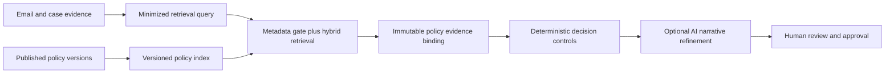
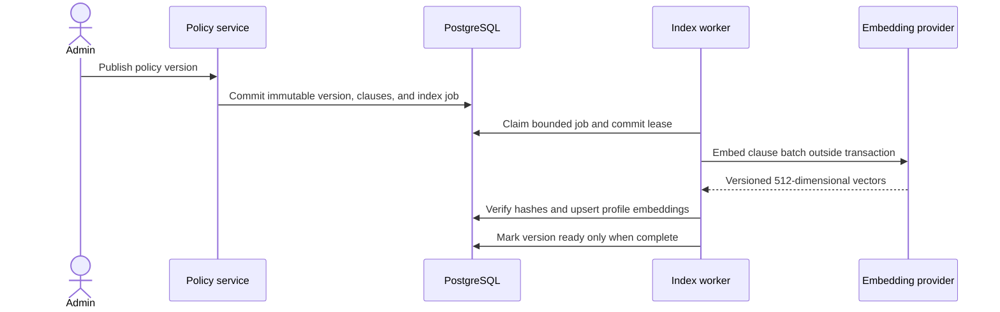

# Governed Policy RAG V2

Status: Phase 4 frozen retrieval gate passed; production activation pending

Date: 2026-08-12

Depends on:

- `docs/backend/POLICY_GOVERNANCE.md`
- `docs/backend/DECISION_BRIEFS.md`
- `docs/product/CONNECTED_WORKFLOW_CONTRACT.md`
- `docs/backend/CONNECTED_INBOX_ARCHITECTURE.md`

## 1. Decision

Evolve the existing governed PostgreSQL retrieval path into a versioned hybrid retriever. Keep
policy authority, applicability, evidence binding, and tenant isolation in the application. Use
OpenAI for an optional embedding provider and bounded narrative refinement; do not move the policy
corpus to an OpenAI-hosted vector store.

RAG V2 is not an autonomous agent. It is one evidence-selection layer inside a deterministic case,
review, and action workflow.

## 2. Existing Baseline

The current governed path already provides:

- immutable published policy versions;
- tenant, category, product, region, channel, tier, and effective-date filters;
- conflict, missing, inapplicable, and stale outcomes;
- pgvector cosine search with an HNSW index;
- exact embedding-version matching;
- immutable case evidence hashes and fingerprints;
- retrieval freshness checks before decision generation;
- deterministic and OpenAI embedding providers;
- OpenAI narrative refinement from a minimized server-owned control record;
- provider calls outside long-lived decision transactions.

RAG V2 must preserve those properties. The upgrade addresses these limitations:

- the current OpenAI profile is reduced to 32 dimensions;
- lexical matching is computed outside PostgreSQL in an older path and is not part of the active
  governed query;
- one vector column couples clause storage to a single embedding shape;
- retrieval scores are not calibrated by a versioned benchmark;
- index readiness and retrieval algorithm version are not first-class operational states.

## 3. Goals

- Improve clause recall for paraphrased support questions.
- Preserve exact keyword matches for policy names, product codes, limits, and exception terms.
- Select the policy version that was applicable at the case decision time.
- Fail closed on missing, conflicting, stale, truncated, or incomplete index state.
- Bind every citation to immutable policy and clause content.
- Allow deterministic development without a paid provider.
- Activate OpenAI embeddings and narrative generation independently.
- Measure retrieval quality, latency, and cost before making quality claims.

## 4. Non-Goals

- Email messages are not added to the policy corpus.
- The model does not decide which policy is published or authoritative.
- An LLM is not used as a reranker in V2.
- The system does not search across organizations.
- The system does not train or fine-tune a model on customer conversations.
- Retrieval does not bypass approval, action, or stale-snapshot checks.
- Existing 32-dimensional embeddings are not rewritten in place.

## 5. Data And Authority Boundaries



Authority order:

1. tenant and role permissions;
2. policy publication and effective-time rules;
3. deterministic applicability and conflict checks;
4. retrieved clause evidence;
5. deterministic risk and approval controls;
6. optional model-written explanation and response draft;
7. human decision.

Model confidence never overrides an earlier layer.

## 6. Retrieval Query Contract

The application builds a bounded query from server-owned fields:

- case category;
- normalized issue statement;
- a short request summary;
- product or service identifiers from verified business context;
- requested remedy when explicitly stated;
- material problem terms selected by deterministic parsing.

The query excludes:

- full raw email threads;
- signatures and quoted history unrelated to the current request;
- access tokens, provider IDs, payment details, addresses, and phone numbers;
- instructions inside email that attempt to change system behavior;
- historical resolution answer keys used only for evaluation.

The normalized query has a hard character and token budget. Its SHA-256 fingerprint may be retained
for audit and cost correlation; the query embedding itself is not persisted with the case.

## 7. Embedding Profiles

An embedding profile is immutable configuration:

```text
profile_key
provider
model
dimensions
normalization_version
chunking_version
index_version
created_at
retired_at
```

Approved profiles:

- `deterministic-hash-v2-d512` for repeatable development and structural tests;
- `openai-text-embedding-3-small-v2-d512` for the controlled semantic evaluation.

The target dimension is 512. It materially improves representation capacity over the current 32
dimensions while remaining modest for the expected policy corpus. This is an evaluation hypothesis,
not a pre-claimed quality improvement. The profile becomes active only after benchmark evidence.

Changing model, dimensions, normalization, chunking, or index behavior creates a new profile. It does
not mutate prior evidence or silently reinterpret stored vectors.

## 8. Additive Schema

### `policy_embedding_profiles`

- immutable profile key, provider, model, dimensions, and version metadata;
- status: `building`, `ready`, `active`, `retired`, or `failed`;
- expected and indexed clause counts;
- build fingerprint, creation time, ready time, and activation actor;
- unique profile key.

Only one active profile is allowed for a deployment environment. Application startup checks that the
configured profile and database profile agree.

### `governed_policy_clause_embeddings_v2`

- organization, policy, policy version, and clause composite identity;
- profile ID and source clause content hash;
- `VECTOR(512)` embedding;
- provider request fingerprint and indexed time;
- unique `(organization_id, clause_id, profile_id)`;
- HNSW cosine index on embedding;
- tenant/profile/clause lookup index.

The source content hash must still equal the immutable clause hash when retrieved. A vector for stale
content is unusable even if its foreign key remains valid.

### Full-text index

Add a generated `search_vector` to governed policy clauses from normalized heading, clause text, and
applicability text using PostgreSQL's `simple` configuration. Add a GIN index. The `simple`
configuration preserves business identifiers and avoids language stemming assumptions in the first
generic release.

### `policy_index_jobs`

Durable bounded jobs for embedding published clauses outside the publication transaction:

- profile, policy version, source content fingerprint, and unique job key;
- `pending`, `running`, `completed`, `failed`, or `dead` state;
- page budget, attempt count, available time, lease, and sanitized error;
- indexed and skipped clause counts.

Publication commits policy authority before any provider call. A newly published version is marked
retrieval-not-ready for a profile until all clause embeddings match its content hashes. Policy
lifecycle still decides whether a previous version retires; retrieval must never keep using a retired
version merely to hide an indexing gap. When the authoritative version is not ready, the service
returns `unavailable` with **Policy search is temporarily unavailable**. It never partially searches
the new version.

### Evidence extension

Extend case policy evidence with:

- embedding profile key;
- retrieval algorithm version;
- query fingerprint;
- dense rank when present;
- lexical rank when present;
- fused retrieval score;
- retrieval run correlation ID.

Existing immutable content, applicability, effective-window, and evidence fingerprints remain.

## 9. Indexing Flow



Indexing rules:

- batch only policy clauses, never case conversations;
- enforce per-document characters, clauses, tokens, and provider-call ceilings;
- reuse an existing embedding only when profile key and content hash both match;
- validate count, dimension, finite values, and provider response order;
- do not hold a database transaction while waiting for OpenAI;
- stop after a finite retry schedule and expose `Index needs attention`;
- publication history remains valid even when a new index build fails.

## 10. Hybrid Retrieval Algorithm

Algorithm version: `policy-hybrid-rrf-v2`.

### Step 1: deterministic metadata gate

Inside the tenant boundary, count and filter immutable published or scheduled versions by:

- case category;
- product set;
- region;
- channel;
- customer tier;
- case decision timestamp against effective window;
- active embedding profile readiness.

Resolve `missing`, `inapplicable`, `stale`, `conflicting`, and index `unavailable` before semantic
ranking. Retrieval cannot rank its way around an authority conflict or incomplete active index.

### Step 2: query embedding

Create one embedding outside a database transaction. A timeout or invalid vector returns a bounded
provider-unavailable result. It does not fall back silently to a vector from another profile.

### Step 3: independent candidate lists

- Dense list: up to 32 matching clauses with cosine distance at or below `0.55`, ordered by
  HNSW cosine distance.
- Lexical list: up to 32 matching clauses with PostgreSQL full-text rank above `0.05`.
- Both lists apply the same tenant, metadata, effective-time, immutable, and profile filters.
- Query-plan tests must prove use of the HNSW and GIN indexes on representative pilot volume.

### Step 4: deterministic fusion

Fuse ranks with reciprocal rank fusion using `1 / (60 + rank)`. Sum contributions for clauses present
in both lists. Break ties by policy public ID, version descending, and clause sequence. Store the
algorithm version so a later formula change cannot silently alter historical evidence.

### Step 5: diversity and threshold

- select at most three clauses;
- keep at most two clauses from one policy unless it is the only applicable authority;
- require at least one result that passed a source-specific relevance floor;
- never return two conflicting decision scopes as if they agreed;
- treat `0.55` as a conservative activation floor, then tighten or relax it only from the frozen
  retrieval evaluation set rather than intuition.

### Step 6: bind under freshness validation

In one short transaction, reload selected policy versions and clauses, verify content and profile
hashes, then write immutable case evidence. If policy or index state changed after ranking, reject the
result as stale and require a fresh retrieval.

## 11. Decision Generation Boundary

The deterministic engine receives bound evidence, never free-form search output. It owns:

- known facts and missing information;
- policy status and exact citations;
- risk checks and approval requirement;
- proposed action types and allowed parameters;
- financial or account impact;
- whether generation must abstain.

The OpenAI narrative gateway may rewrite only rationale, uncertainty, subject, and body from the
minimized control record. Pydantic validation rejects extra fields. Post-generation checks reject:

- facts, amounts, actions, or policy claims absent from the control record;
- claims that a pending action already happened;
- citations not present in the bound evidence;
- instructions copied from an email as though they were system authority.

No LLM reranker is added in V2. It would add cost, latency, and a second uncalibrated authority-like
decision before the basic hybrid retriever is measured.

## 12. OpenAI Activation Boundary

OpenAI activation is split into two independent settings:

- `policy_v2_embedding_provider=openai` builds the governed OpenAI policy profile while V1 remains
  live;
- `model_provider=openai` activates bounded narrative refinement.

The controlled profile is immutably pinned to `text-embedding-3-small` with 512 requested dimensions;
changing that model requires a new profile key. A project-scoped API key remains backend-only. Every
Responses API request keeps `store=False`.

Activation order:

1. deterministic profile and fake gateway tests;
2. deterministic 512-dimensional index build;
3. one bounded live embedding smoke using synthetic policy and query text;
4. complete policy reindex in the disposable environment;
5. failure-isolated shadow retrieval comparison that always preserves the V1 result and records
   status/count metadata without policy text;
6. explicit active-profile switch after evaluation;
7. narrative provider activation using synthetic connected cases;
8. Gmail-derived inputs only after the connected-workflow AI data gate passes.

OpenAI states that API data is not used to train models by default unless the customer opts in, while
default abuse-monitoring logs may retain customer content for up to 30 days. `store=False` prevents
Responses application-state storage but is not a Zero Data Retention claim.

## 13. Retrieval Evaluation

Create a frozen, answer-separated retrieval set with:

- query and deterministic case context;
- decision timestamp;
- expected policy public ID, version, and relevant clause IDs;
- explicitly irrelevant near-match clauses;
- stale, inapplicable, conflicting, missing, and cross-tenant negatives;
- source type identifying synthetic, public, or approved client data.

Primary metrics:

- policy and version accuracy;
- `Recall@3` for expected clauses;
- mean reciprocal rank;
- wrong-version and cross-tenant retrieval count;
- unsupported citation count;
- correct abstention by failure state;
- retrieval p50/p95 latency;
- embedding calls, tokens, and cost per case.

Initial release gates:

- policy/version correctness: 100 percent on safety-critical fixtures;
- cross-tenant results: zero;
- unsupported citations: zero;
- wrong active version: zero;
- correct failure-state classification: 100 percent on explicit negative fixtures;
- `Recall@3`: at least 0.90 on the frozen relevant-query set;
- MRR: recorded and compared with baseline; no fixed claim until the set is large enough.

The existing six-case workflow benchmark remains calibration evidence, not a sufficient retrieval
benchmark or production claim.

## 14. Security And Privacy Controls

- Treat policy documents and case queries as untrusted data, never instructions.
- Escape or delimit retrieved passages in the model input.
- Enforce tenant scope in SQL, not after retrieval.
- Never log policy bodies, case queries, vectors, raw email, or model prompts.
- Store provider request IDs only when they contain no customer data.
- Use source and query fingerprints for correlation.
- Delete temporary batch payloads after the provider call.
- Keep answer keys outside runtime fixtures and model inputs.
- Require explicit disclosure and organizational authorization before sending Gmail-derived data to
  OpenAI.
- Continue operating in deterministic mode when the data-transfer gate is off.

## 15. Cost And Resource Controls

- Hard-cap clauses, characters, and batches per index job.
- Deduplicate by content hash and profile before calling the embedding provider.
- Embed policy clauses in bounded batches; embed each case query once per retrieval attempt.
- Do not persist or repeatedly recompute embeddings during page rendering.
- Record safe usage counters by provider, model, profile, and organization.
- Enforce an application-side daily call and token ceiling in addition to provider billing alerts.
- Keep provider timeout and retries bounded.
- Use one local test worker and serial provider smoke tests under the resource blacklist.

## 16. Additive Migration

1. Create profile, V2 embedding, and index-job tables.
2. Add full-text search vector and GIN index.
3. Add nullable evidence metadata columns for V2.
4. Seed the deterministic V2 profile without activating it.
5. Backfill immutable published clauses in bounded jobs.
6. Verify counts, hashes, dimensions, constraints, and query plans on a disposable Neon branch.
7. Run shadow retrieval against V1 and the frozen evaluation set.
8. Mark one profile ready, then switch the configured read profile.
9. Keep V1 columns and reads available for one rollback window.
10. Remove V1 only in a separate later migration after retained evidence no longer depends on it.

No migration performs an OpenAI network request. Provider backfill is an explicit application job
after schema migration.

## 17. Rollback

- Switch the active profile back to deterministic V1 or V2 without rewriting evidence.
- Disable OpenAI embeddings independently from OpenAI narrative generation.
- Stop index jobs without changing policy publication state.
- Leave V2 tables intact during application rollback.
- Evidence already bound remains readable using stored profile and algorithm metadata.
- A failed V2 build never makes a partial profile active.

## 18. Verification Matrix

### Unit

- profile identity and immutable configuration;
- 512-dimensional deterministic and OpenAI vector validation;
- bounded query minimization and identifier removal;
- reciprocal-rank fusion, tie-breaking, diversity, and abstention;
- prompt-injection isolation and post-generation claim checks;
- finite retry and cost ceilings.

### PostgreSQL

- tenant and effective-time filters are present in dense and lexical queries;
- HNSW and GIN indexes are created and used at representative scale;
- incomplete profiles cannot become active;
- concurrent index jobs do not duplicate embeddings;
- stale clause hash prevents evidence binding;
- profile switch and rollback preserve prior evidence.

### Provider

- request model and dimensions are exact;
- invalid count, dimension, NaN, timeout, rate limit, and provider error fail safely;
- no raw Gmail payload is sent;
- Responses calls retain `store=False`;
- secrets and content are absent from logs.

### Evaluation

- frozen expected results remain withheld from retrieval inputs;
- V1 deterministic, V2 deterministic, and V2 OpenAI runs use the same queries and metadata;
- metrics and raw outcomes are stored before conclusions are written;
- quality and cost claims identify dataset size and source.

## 19. Phase 4 Implementation And Evaluation Status

The additive schema, versioned embedding profiles, bounded index worker, metadata gate, hybrid
PostgreSQL retrieval, RRF ranking, evidence lineage, deterministic provider, and OpenAI embedding
adapter are implemented. V1 remains the default and V2 can be evaluated deterministically in shadow
mode before activation.

Dense and lexical candidates now fail closed behind explicit relevance floors. The initial `0.55`
dense-distance and `0.05` lexical-rank floors are deliberately conservative and are not quality
claims; hosted activation still requires the frozen retrieval benchmark described above. Retrieval
readiness is checked against the current tenant and matching policy scope, so an unfinished index in
another tenant cannot block a complete local scope.

The frozen answer-separated evaluator now covers 15 synthetic cases: eight relevant queries over all
eight governed clauses, two release-corpus negatives, and five explicit guard-contract negatives.
On 2026-08-15, V1 deterministic, V2 deterministic, and V2 OpenAI each recorded `Recall@3 = 1.0`,
MRR `1.0`, status accuracy `1.0`, zero wrong versions, zero unsupported citations, and zero
cross-tenant results. See the [benchmark evidence](../../backend/evaluations/retrieval_v2/README.md).

The first deterministic V2 run exposed an overly restrictive full-text query: a long web-search
query behaved like an all-term filter and missed the duplicate-charge clause. The lexical query is
now a bounded deterministic OR set, and the unchanged hash-locked dataset passes. Live OpenAI query
retrieval remains a deliberate production gate. The evaluator uses transaction-scoped store calls,
so provider embedding happens with no database session held, but application configuration still
rejects OpenAI V2 query activation until the runtime activation boundary is separately approved.
See the [activation runbook](../runbooks/CONNECTED_INBOX_AND_RAG_V2_ACTIVATION.md).

## 20. External References

- [OpenAI embeddings guide](https://developers.openai.com/api/docs/guides/embeddings)
- [OpenAI text-embedding-3-small](https://developers.openai.com/api/docs/models/text-embedding-3-small)
- [OpenAI API data controls](https://developers.openai.com/api/docs/guides/your-data)
- [pgvector](https://github.com/pgvector/pgvector)
- [PostgreSQL full-text search](https://www.postgresql.org/docs/current/textsearch.html)
