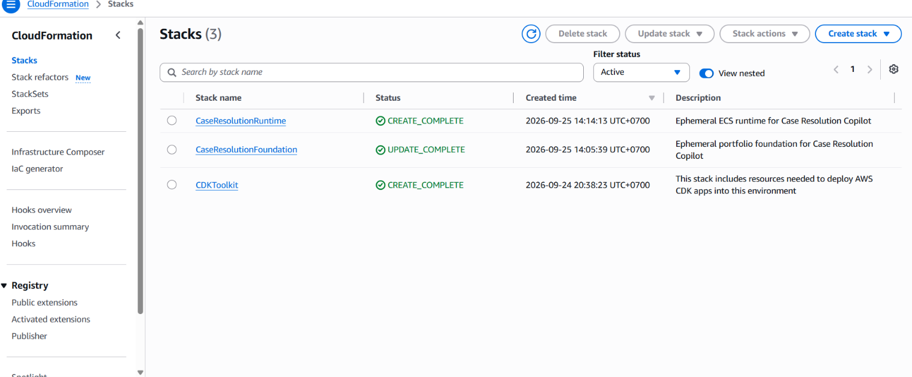
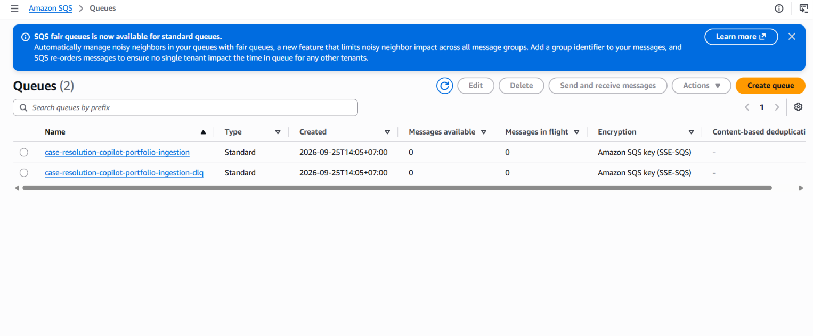
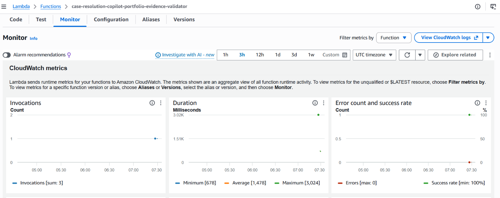

# AWS Live Validation

Latest validation date: September 25, 2026 
Validated source revision: `0a92c4b23f655b037a45c0999a1530c49d19d3ed`

The repository's disposable AWS CDK environment was deployed to `ap-southeast-1`, validated, and
destroyed. This record supports the claim that the deployment path works on live AWS services. It
does not claim permanent production hosting or customer traffic on AWS.

## Passed Checks

- Foundation and Runtime CloudFormation stacks completed successfully.
- The CloudFront API health endpoint returned HTTP `200`.
- API, Celery worker, and Celery Beat scheduler reached stable ECS service state.
- The one-off Alembic migration task exited with code `0` at revision `20260813_0024`.
- PostgreSQL connectivity and the `pgvector` extension were verified from the running task.
- A versioned S3 input triggered Lambda validation and produced a content-addressed output manifest.
- Lambda delivered the validation request through SQS to the Celery worker.
- The connected Celery task recorded `aws_validation_passed` after querying RDS.
- The SQS dead-letter queue remained empty.
- A running Celery worker task was stopped deliberately. ECS replaced it, returned the service to
  one desired/running task, and the full connected validation passed again.
- Replaying the same versioned S3 input produced two Lambda validations and two worker successes but
  retained one content-addressed logical output manifest. The dead-letter queue remained empty.
- ECR stored an immutable image digest after scanning; no critical or unapproved high findings were
  accepted.
- Both application stacks were destroyed and a post-teardown inventory found no application RDS,
  ALB, ECS, ECR, SQS, Lambda, CloudFront, Secrets Manager, scheduler, or Step Functions resources.

The final run began at `07:05:01 UTC`. Operator teardown completed at `07:48:57 UTC`, before the
`07:55:01 UTC` manual target and the `08:05:01 UTC` AWS watchdog. Sanitized machine-readable results
are available in [`2026-09-25-results.json`](2026-09-25-results.json).

## Sanitized Console Evidence

### CloudFormation deployment

Both application stacks reached a completed state before validation. `CDKToolkit` is the account and
region bootstrap stack, not an always-on application workload.

### SQS and dead-letter queue

The ingestion queue and its dead-letter queue were empty after the connected validation and replay
checks.

### Lambda validation

The evidence validator recorded three successful invocations with zero errors during the final
evidence window. The invocations cover the initial validation, post-recovery validation, and replay.

Screenshots containing the AWS account ID, user identity, or full account-scoped ARN were excluded
instead of publishing partially redacted originals. ECS recovery, watchdog timing, database state,
and teardown are supported by the sanitized command evidence and results file.

## Safety Boundary

- The always-on portfolio demo remains on Vercel with Neon PostgreSQL.
- Credentials were loaded from ignored local files into Secrets Manager and were not included in
  evidence or repository history.
- The environment used a cost-aware single-AZ profile and an AWS-side auto-destroy watchdog.
- This run validates deployment mechanics and the connected infrastructure path, not production
  availability, disaster recovery, sustained load, or customer data handling.
