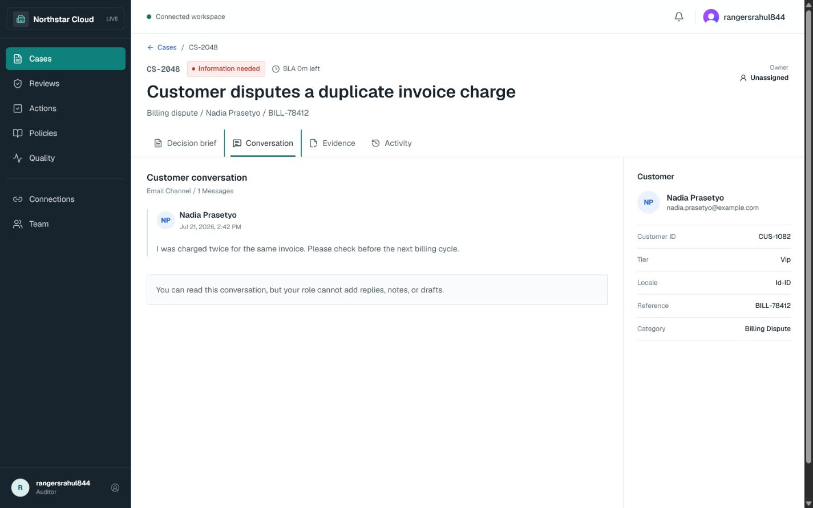
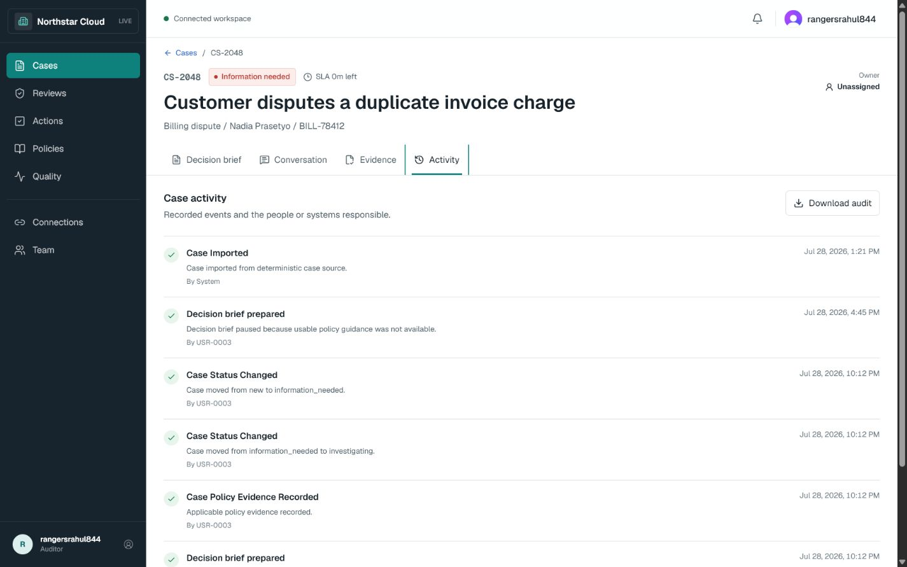
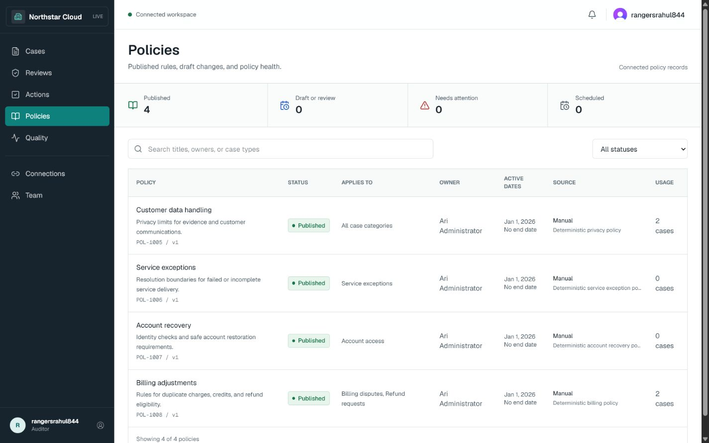
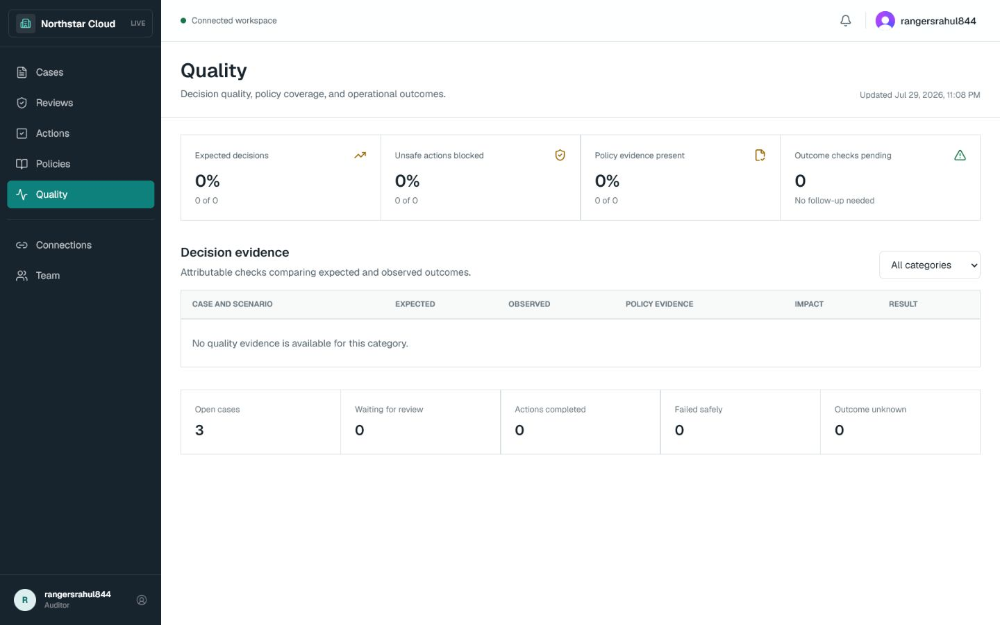
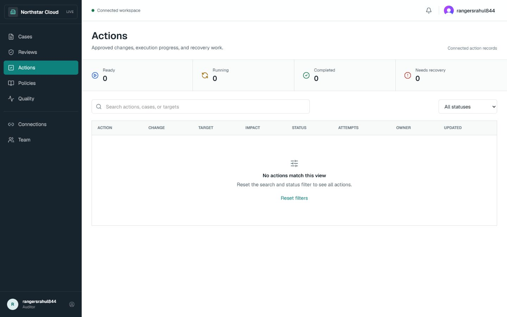
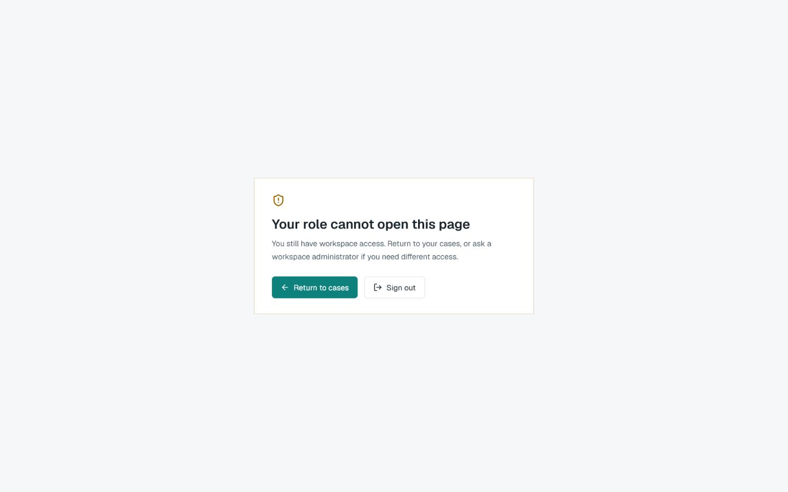

# Case Resolution Copilot - Production Walkthrough Evidence

Captured: 29 July 2026

## Scope

These screenshots were captured from the deployed application at
<https://ai-support-escalation-copilot.vercel.app> using the live Auditor identity.

- Release state: deployed Portfolio V1 plus the final first-use copy patch
- Workspace: labelled demo workspace
- Case used: `CS-2048`
- Browser control: bounded in-app navigation and screenshots
- Mutations performed: none
- Audit export downloaded: no
- External action executed: no

The walkthrough verifies rendered production states. It is not a penetration, accessibility, load,
or client acceptance test.

## Walkthrough

### 1. Cases Queue

The connected queue renders three generic demo cases with priority, status, risk, owner, SLA,
source freshness, and update time.

### 2. Decision Brief

Case `CS-2048` exposes a source-backed issue summary, verified facts, missing information,
recommended next step, uncertainty, and the human-review boundary.

### 3. Conversation

The Auditor can read the conversation and customer context. The page states plainly that this role
cannot add a reply, note, or draft.

### 4. Evidence

The Evidence tab connects policy clauses, applicability reasons, risk checks, and business records
without hiding missing information.

### 5. Activity

The Activity tab shows attributable case events. Audit export authority is visible to the Auditor;
the walkthrough did not download an export.

### 6. Policies

Four published demo policies render with status, applicability, owner, effective dates, source,
and case usage.

### 7. Quality

The production Quality page renders an honest zero-evidence state. Public benchmark results are
kept outside this page because they are not production case-quality records.

### 8. Actions Finding

No approved live actions exist. The production capture exposed misleading first-use copy that said
filters had hidden existing records. The final patch changes this state to `No approved actions
yet` and keeps reset guidance only for filtered non-empty datasets.

This screenshot is retained as pre-fix discovery evidence, not as the final UI.

### 9. Role Denial

Direct navigation to Administrator settings redirects the Auditor to a plain-language denial page
with safe navigation choices.

## Observed Boundaries

- Reviews and Actions are empty because no consequential live workflow was fabricated.
- Quality has no production evaluation rows because the public benchmark remains separate.
- Client-owned case intake and controlled-action sandboxes are not active.
- The screenshots contain only labelled demo records and a test-role account handle.
