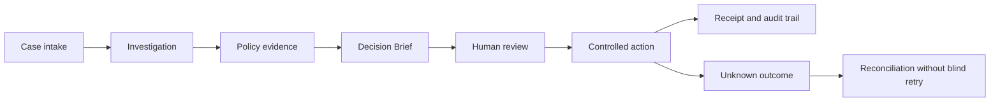
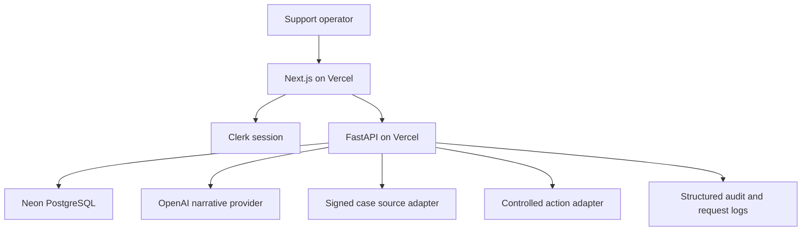

# Case Resolution Copilot - Engineering Case Study

## Product Thesis

Most support tools optimize ticket handling and reply speed. Complex cases requiring judgment have
a different problem: facts are incomplete, policies change over time, authority is limited, and an
incorrect action may affect a customer account or company finances.

Case Resolution Copilot is a policy-governed decision workspace for those cases. It helps an
operator understand what happened, identify missing evidence, retrieve the applicable policy
version, prepare a proposed resolution, obtain human approval, and execute a controlled action
with an auditable recovery path.

It is not designed to let an LLM make consequential decisions by itself.

## Governed Coverage At A Glance

| Metric | What it demonstrates | Evidence |
| ---: | --- | --- |
| **4** | Governed roles: Specialist, Supervisor, Administrator, and Auditor | [Baseline acceptance matrix](../../backend/evaluations/acceptance/local_release_matrix.json) |
| **71** | Baseline acceptance variants covering 54 controls | [Baseline acceptance matrix](../../backend/evaluations/acceptance/local_release_matrix.json) |
| **19** | Baseline traceable proofs across 8 scenarios and 21 workflow variants | [Workflow traceability map](../../backend/evaluations/workflow/traceability.json) |
| **83.7%** | Raw median elapsed time lower in a developer-operated matched synthetic benchmark: 95 s with Copilot versus 582 s manually | [Workflow benchmark report](../evidence/developer-workflow-benchmark/REPORT.md) |

These figures describe governed workflow coverage, traceability, and bounded workflow timing. The
time-saved figure is descriptive evidence from one operator and three matched synthetic cases per
condition; it is not a population-level productivity or customer-impact claim.

## Users And Workflow

| Role | Primary responsibility |
| --- | --- |
| Specialist | Investigate a case, gather facts, and prepare a resolution |
| Supervisor | Review proposals and authorize eligible actions |
| Administrator | Manage team access, policies, settings, and high-risk authority |
| Auditor | Inspect cases, evidence, quality results, and audit records without changing them |

The core workflow is:

## What Was Built

- A Next.js operational workspace for Cases, Reviews, Actions, Policies, Quality, Connections,
  Team, and Settings.
- A FastAPI modular backend with tenant-scoped PostgreSQL persistence.
- Clerk authentication with backend-owned organizations, memberships, roles, and permissions.
- Versioned policy governance with applicability rules and immutable evidence bindings.
- OpenAI-assisted Decision Brief wording wrapped by deterministic facts, policy, risk, and approval
  controls.
- Immutable review snapshots so an approval applies to one exact proposal and evidence version.
- Signed case-intake and controlled-action adapters with replay protection, idempotency,
  attributable receipts, and unknown-outcome reconciliation.
- Structured correlated logs, health/readiness contracts, and a bounded pilot-SLO evaluator.
- Celery/Redis async delivery for durable inbox and policy-index jobs, including finite retries,
  status inspection, duplicate-safe execution, and explicit reprocessing.
- A credential-free governed RAG evaluator with expected-source checks, latency metrics, and
  sanitized failure events.
- An AWS-ready ECS/Fargate deployment pack with RDS PostgreSQL/pgvector, ElastiCache Redis, S3,
  Secrets Manager, CloudWatch, IAM, migration, and rollback guidance; no AWS deployment is claimed.

## Architecture

The browser never owns role authority. FastAPI verifies the Clerk session subject, resolves the
active internal membership, and authorizes every protected operation from server-owned
permissions.

## Important Engineering Decisions

### Human approval is a system boundary

The model can help organize evidence and draft language, but it cannot grant authority. Reviews
bind the proposal version, policy evidence, risk state, reviewer, and decision into an immutable
snapshot.

### Unknown outcomes are not ordinary failures

When an external action times out after a request may have reached the provider, the system does
not retry blindly. It records an unknown side-effect state and uses receipt lookup or
reconciliation to establish the outcome.

### Policy evidence is versioned

A case records the policy version and evidence that supported the recommendation. Publishing a new
policy does not silently rewrite historical reasoning.

### Evaluation claims stay task-specific

Public complaint, ombudsman, and transaction datasets remain separate. The project does not combine
unrelated records into fictional complete business cases or report a misleading aggregate score.

## How This Was Verified

### Current reconstructed source

| Evidence | Result |
| --- | ---: |
| Release-hardening static checks | Ruff, Mypy over 290 backend application files, TypeScript, and ESLint passed |
| Release-hardening regressions | 389 backend unit/contract tests and 160 frontend tests passed serially |

The full release verifier and guarded PostgreSQL integration suite have not been rerun for the
reconstructed revision.

### Baseline matrices

- The [acceptance matrix](../../backend/evaluations/acceptance/local_release_matrix.json) records
  54 controls and 71 acceptance variants.
- The [workflow traceability map](../../backend/evaluations/workflow/traceability.json) records 8
  scenarios, 19 traceable proofs, and 21 workflow variants.

These are committed baseline coverage artifacts, not a fresh full-release or database rerun.

### Historical hosted evidence

The [deterministic hosted acceptance](../evidence/hosted-e2e-acceptance/2026-08-05/README.md)
records Specialist submission, Supervisor approval, a completed controlled action with a durable
receipt, duplicate blocking, and Auditor read-only inspection for synthetic case `CS-2050`. It was
captured from the predecessor hosted deployment and is not evidence that the reconstructed commit
is currently deployed.

### Developer-operated workflow benchmark

In a matched synthetic benchmark, Case Resolution Copilot produced `3/3` complete safe workflow
outcomes versus `0/3` manually under the same scoring boundary. Raw median elapsed time was `95 s`
with Copilot versus `582 s` manually, which is `487 s` lower (`83.7%`, `6.1x`). See the
[workflow benchmark report](../evidence/developer-workflow-benchmark/REPORT.md) for the scoring
boundary and timing table.

### Historical benchmark evidence

The predecessor deterministic public baseline processed 86 separated records and produced:

| Suite | Records | Accuracy | Macro F1 |
| --- | ---: | ---: | ---: |
| CFPB response category | 36 | 0.500 | 0.417 |
| Financial Ombudsman disposition | 10 | 0.600 | 0.508 |
| UCI cancellation relationship | 40 | 1.000 | 1.000 |

The UCI result validates an exact matching adapter rule, not general AI reasoning. The baseline is
not the production Decision Brief model.

Its recorded model-capability lane then produced:

| Suite | Records | Accuracy | Macro F1 | Abstain |
| --- | ---: | ---: | ---: | ---: |
| CFPB response category | 36 | 0.000 | 0.000 | 1.000 |
| Financial Ombudsman disposition | 10 | 0.400 | 0.546 | 0.500 |
| UCI cancellation relationship | 40 | 1.000 | 1.000 | 0.000 |

On the five FOS records it answered, model accuracy was `0.800`; all 32 FOS evidence quotes were
grounded. The model treated CFPB as underdetermined, as instructed, and abstained, but the v1
request layout also caused some CFPB citations to quote instructions or JSON keys. Prompt v2 fixes
that layout and has not been rescored. These are separate model-capability metrics, not an
end-to-end product score.

## Historical Hosted Evidence

- Frontend and backend were observed on Vercel in Singapore.
- Neon PostgreSQL runs in Singapore at deployed revision `20260730_0019`; disposable migration,
  integration, and query-plan verification preceded active promotion under a seven-day rollback
  checkpoint.
- Production Clerk sign-in, protected routing, database-backed case and policy reads, and one
  OpenAI-assisted Decision Brief refresh passed.
- Separate Specialist, Supervisor, Administrator, and Auditor identities passed live read and
  denial journeys.
- Auditor export authority and read-only conversation behavior were observed live.
- The authenticated hosted gate passed queue-to-workspace navigation, all workspace tabs, seven
  operations routes, and desktop/mobile overflow checks after closing a queue adapter defect.
- A separate deterministic hosted journey completed specialist submission, supervisor approval,
  one controlled action, durable receipt capture, duplicate protection, and auditor read-only
  inspection.
- A screenshot-backed production walkthrough records the queue, Decision Brief, conversation,
  evidence, activity, policies, quality, actions, and role-denial states.

### Defects found during hosted acceptance

**Blocked connection state was hidden.** The action detail contract initially rejected the valid
`not_configured` state while the queue discarded its execution blocker. The reconstructed source
accepts the state and surfaces `Connection unavailable` instead of hiding why execution is blocked.

**An approved terminal review appeared undecided.** After action execution changed the case, stale
case messaging took precedence over the review's terminal `approved` state. The UI now keeps the
approval visibly complete and explains that later case changes do not rewrite the recorded review;
a focused regression covers this state.

## Current Verdict

The project is a **controlled-pilot release candidate** and a production-oriented portfolio
project. It is not valid to claim general production readiness or validation on complete internal
business cases.

The remaining evidence boundaries are concise: the reconstructed full release and guarded
PostgreSQL suite still require reruns, external case and action providers remain simulated, and no
customer-impact claim has been established.

## Resume Summary

> Built an AI-assisted case decision system using Next.js, FastAPI, PostgreSQL, Clerk, and an
> optional OpenAI provider, with governed policy retrieval, human approval, audit trails,
> controlled-action recovery, four-role access control, and a blind public-data evaluation lane.
